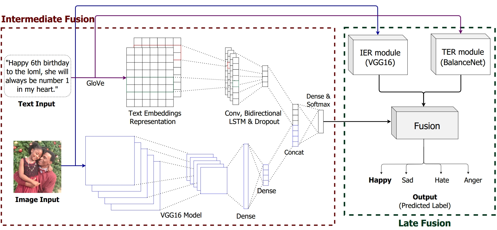

Hybrid Fusion Based Approach for Multimodal Emotion Recognition with Insufficient Labeled Data 
==============================================================================================

Implementation for the paper (ICIP 2021). The paper has been accepted, its full-text will be shared after publication.<br>
**[Hybrid Fusion Based Approach for Multimodal Emotion Recognition with Insufficient Labeled Data][1]**<br>
[Puneet Kumar](https://puneet-kr.github.io/), Vedanti Khokher, Yukti Gupta, and [Balasubramanian Raman](http://faculty.iitr.ac.in/~balarfma/)  

<!---->


<!---
If you use this code in your published research, please consider citing:
```text
@inproceedings{}
```
--->

Setup and Dependencies
----------------------
1. Install Anaconda or Miniconda distribution and create a conda environment with **Python 3.8+**.
2. Install the requirements using the following command:
```sh
pip install -r Requirements.txt
```
3. Download the [BT4SA dataset][2] and keep in `data_t4sa` folder.
4. Download [glove.twitter.27B.200d.txt][3] and keep in `data_files` folder.
5. Rest of the data files are already provided in the	`data_files` folder.

Steps to run the Code
---------------------
1. **Text Emotion Recognition Phase**:<br>
Run `TER.ipynb` in Jupyter Notebook<br> 
OR<br> 
Run `TER.py` in the terminal/command-line using the following command:
```sh
python TER.py --epoch=100
```
*Reference:* The code from TER phase has been referred from [here][4].


2. **Image Emotion Recognition Phase**:<br>
Run `IER.ipynb` in Jupyter Notebook<br> 
OR<br> 
Run `IER.py` in the terminal/command-line using the following command:
```sh
python IER.py --epoch=100
```
*Reference:* [This][5] code served as an inspiration for building the code for the IER phase.

3. **Intermediate Fusion Phase**:<br> 
Run `Intermediate_fusion.ipynb` in Jupyter Notebook<br> 
OR<br> 
Run `Intermediate_fusion.py` in the terminal/command-line using the following command:
```sh
python Intermediate_fusion.py --epoch=100
```

4. **Late Fusion Phase**:<br> 
Run `Late_fusion.ipynb` OR `python Late_fusion.py`.

### Saving Model Checkpoints  
By default, the code saves the model checkpoints in the `model_checkpoints` folder. *Troubleshooting:* Sometimes the 'Kernel dead' error is caused if the model checkpoints are not properly saved or loaded.

### Tensorboard Logging
The tensorboard log files are saved in the `tb_logs` folder for IER, TER and Intermediate_fusion. These files can be accessed using the following command:
```sh
tensorboard --logdir "/tb_logs"
```

Dataset Access
--------------
Access to the ‘IIT Roorkee Text and Image Emotion Recognition (IIT-R TIER) dataset’ can be obtained by through [`Access Form - IIT-R TIER Dataset.pdf`][6]. The dataset is compiled by Puneet Kumar, Yukti Gupta, and Vedanti Khokher at Machine Intelligence Lab, IIT Roorkee under the supervision of Prof. Balasubramanian Raman. It contains 97,170 images and corresponding text labeled with Emotion class, i.e., Happy, Sad, Hate, and Anger. 

[1]: https://2021.ieeeicip.org/
[2]: http://www.t4sa.it/
[3]: https://nlp.stanford.edu/projects/glove/
[4]: https://github.com/tlkh/text-emotion-classification
[5]: https://github.com/krishnaik06/Transfer-Learning
[6]:https://github.com/MIntelligence-Group/Image-Text_EmoRec/blob/main/Access%20Form%20-%20IIT-R%20TIER%20Dataset.pdf 
